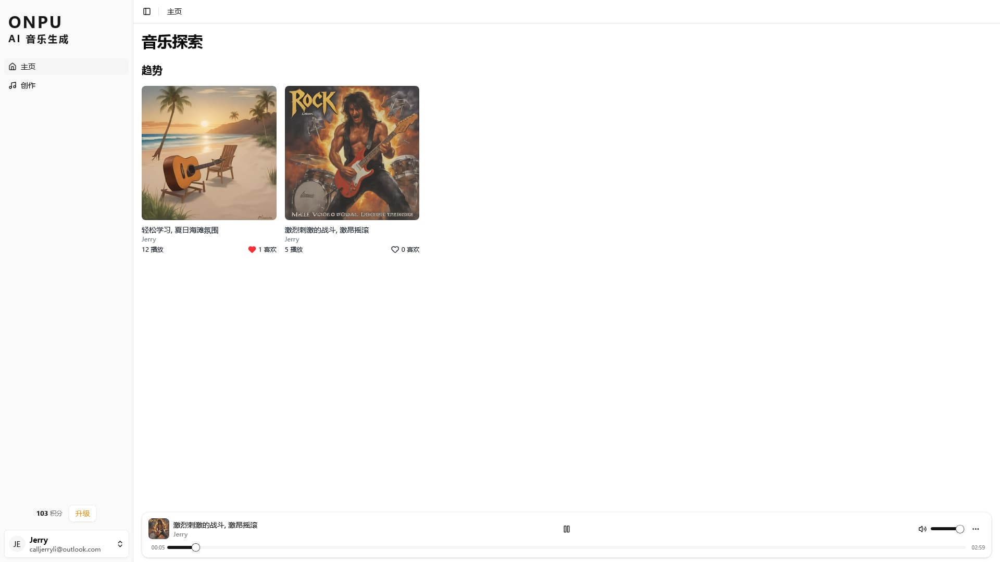
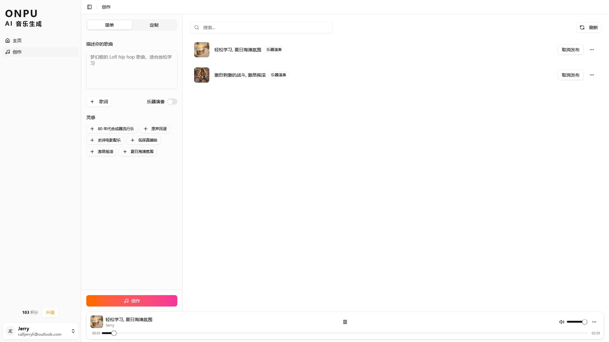

# Onpu - AI 音乐生成平台

_Onpu_ 是一个使用 AI 生成音乐的 SaaS 平台，可以从简单的文本描述、自定义歌词或风格提示中创作音乐。

平台集成了包括 Better Auth 用户认证、使用 Polar.sh 的积分支付系统，以及用于处理 AI 工作流的后台队列 Inngest 等技术。

## 在线体验

TODO

_Demo 实例受成本限制，目前无法稳定提供服务。如果这个项目对你有价值，欢迎[为我充电](https://space.bilibili.com/281356255)！_

## 技术栈

**AI**

- 音乐生成模型: ACE-Step
- 歌词生成模型: Qwen/Qwen2.5-7B-Instruct
- 封面生成模型: stabilityai/sdxl-turbo
- 对象存储: Cloudflare R2
- 推理设施: Modal
- 工作流: Inngest

**Web**

- Next.js
- Zustand
- Tailwind CSS
- shadcn/ui
- Better Auth
- Drizzle ORM
- PostgreSQL
- Polar.sh

## 运行

按照以下步骤安装和设置项目

### 克隆代码仓库

```bash
git clone https://github.com/jerryshell/onpu.git
```

### 安装 Python

请下载并安装 Python 3.12: https://www.python.org/downloads

### AI

安装依赖项

```bash
cd ai
```

```bash
pip install -r requirements.txt
```

Modal 设置

```bash
modal setup
```

Modal 本地运行

```bash
modal run main.py
```

Modal 部署

```bash
modal deploy main.py
```

### Web

安装依赖项

```bash
cd web
```

```bash
npm i
```

`.env` 文件

```env
# Database
DATABASE_URL=
# Better Auth
BETTER_AUTH_SECRET=
GITHUB_CLIENT_ID=
GITHUB_CLIENT_SECRET=
# S3
S3_ENDPOINT_URL=
S3_BUCKET_NAME=
S3_AWS_ACCESS_KEY_ID=
S3_AWS_SECRET_ACCESS_KEY=
# Modal
MODAL_KEY=
MODAL_SECRET=
MODAL_URL_GENERATE_WITH_LYRICS=
MODAL_URL_GENERATE_WITH_DESCRIBED_LYRICS=
MODAL_URL_GENERATE_FROM_DESCRIPTION=
# Polar
POLAR_SERVER=sandbox
POLAR_ACCESS_TOKEN=
POLAR_WEBHOOKS_SECRET=
NEXT_PUBLIC_POLAR_SAMLL_CREDIT_PACK=
NEXT_PUBLIC_POLAR_MEDIUM_CREDIT_PACK=
NEXT_PUBLIC_POLAR_LARGE_CREDIT_PACK=
```

运行

```bash
npm run dev
```

### Inngest 本地队列开发

```bash
cd web
```

```bash
npx inngest-cli@latest dev
```

## 项目截图

<div align="center">
  
  <p><em>主页</em></p>

  
  <p><em>创作</em></p>
</div>

## 开源协议

[GNU Affero General Public License v3.0](LICENSE)
