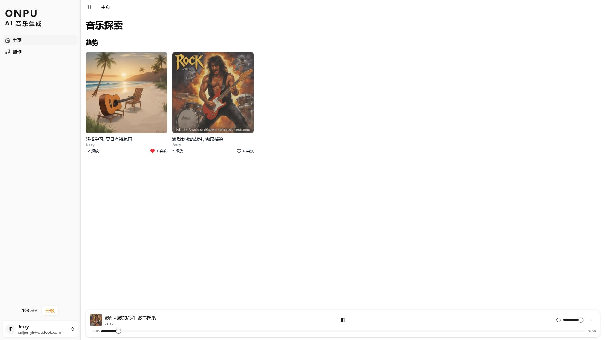
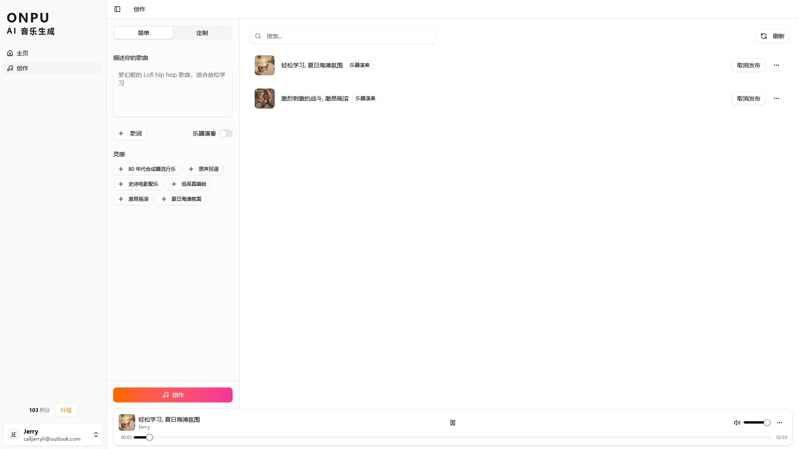

# Onpu - AI 音乐生成平台

_Onpu_ 是一个使用 AI 生成音乐的 SaaS 平台，可以从简单的文本描述、自定义歌词或风格提示中创作音乐

平台集成了包括 Better Auth 用户认证、Polar.sh 积分支付，以及用于处理 AI 工作流的后台队列 Inngest 等技术

## 在线体验

https://onpu.vercel.app

_Demo 实例受成本限制，目前无法稳定提供服务。如果这个项目对你有价值，欢迎[为我充电](https://space.bilibili.com/281356255)！_

## 技术栈

**AI**

- 音乐生成模型: [ACE-Step](https://github.com/ace-step/ACE-Step)
- 歌词生成模型: [Qwen/Qwen2.5-7B-Instruct](https://huggingface.co/Qwen/Qwen2.5-7B-Instruct)
- 封面生成模型: [stabilityai/sdxl-turbo](https://huggingface.co/stabilityai/sdxl-turbo)
- 对象存储: [Cloudflare R2](https://developers.cloudflare.com/r2)
- 推理设施: [Modal](https://modal.com)
- 工作流: [Inngest](https://github.com/inngest/inngest)

**Web**

- [Next.js](https://nextjs.org)
- [Zustand](https://github.com/pmndrs/zustand)
- [Tailwind CSS](https://tailwindcss.com)
- [shadcn/ui](https://ui.shadcn.com)
- [Better Auth](https://www.better-auth.com)
- [Drizzle ORM](https://orm.drizzle.team)
- [PostgreSQL](https://www.postgresql.org)
- [Polar.sh](https://polar.sh)

## 运行

按照以下步骤安装和设置项目

### 克隆代码仓库

```bash
git clone https://github.com/jerryshell/onpu.git
```

### AI

Modal 设置

```bash
modal setup
```

配置 Modal Secrets

需要在 Modal 中创建名为 `onpu-secret` 的 Secret，包含以下环境变量：

- `S3_ENDPOINT_URL`: S3 兼容存储的端点 URL
- `S3_BUCKET_NAME`: S3 存储桶名称
- `S3_AWS_ACCESS_KEY_ID`: S3 访问密钥 ID
- `S3_AWS_SECRET_ACCESS_KEY`: S3 访问密钥

API 端点

项目提供三个主要的音乐生成 API 端点：

1. **从描述生成音乐** (`generate_from_description`)

   - 输入：完整的音乐描述文本
   - 自动生成提示词和歌词
   - 请求参数：
     ```python
     {
       "full_described_song": str,  # 完整的音乐描述
       "audio_duration": float,     # 音频时长（秒），默认 180.0
       "seed": int,                 # 随机种子，-1 为随机
       "guidance_scale": float,      # 引导强度，默认 15.0
       "infer_step": int,           # 推理步数，默认 60
       "instrumental": bool          # 是否为纯音乐，默认 False
     }
     ```

2. **使用自定义歌词生成** (`generate_with_lyrics`)

   - 输入：提示词和自定义歌词
   - 请求参数：
     ```python
     {
       "prompt": str,               # 音乐风格提示词
       "lyrics": str,               # 自定义歌词
       "audio_duration": float,     # 音频时长（秒），默认 180.0
       "seed": int,                 # 随机种子，-1 为随机
       "guidance_scale": float,      # 引导强度，默认 15.0
       "infer_step": int,           # 推理步数，默认 60
       "instrumental": bool          # 是否为纯音乐，默认 False
     }
     ```

3. **使用描述的歌词生成** (`generate_with_described_lyrics`)

   - 输入：提示词和歌词描述
   - 自动根据描述生成歌词
   - 请求参数：
     ```python
     {
       "prompt": str,               # 音乐风格提示词
       "described_lyrics": str,     # 歌词描述
       "audio_duration": float,     # 音频时长（秒），默认 180.0
       "seed": int,                 # 随机种子，-1 为随机
       "guidance_scale": float,     # 引导强度，默认 15.0
       "infer_step": int,           # 推理步数，默认 60
       "instrumental": bool         # 是否为纯音乐，默认 False
     }
     ```

响应格式

所有 API 端点返回以下格式：

```python
{
  "s3_key": str,              # 音频文件在 S3 中的键
  "cover_image_s3_key": str,  # 封面图在 S3 中的键
  "categories": List[str]     # 音乐分类标签列表
}
```

Modal 本地运行

```bash
modal run main.py
```

Modal 部署

```bash
modal deploy main.py
```

### Web

安装依赖项

```bash
cd web
```

```bash
npm i
```

`.env` 文件

```env
# Database
DATABASE_URL=
# Better Auth
BETTER_AUTH_SECRET=
GITHUB_CLIENT_ID=
GITHUB_CLIENT_SECRET=
# S3
S3_ENDPOINT_URL=
S3_BUCKET_NAME=
S3_AWS_ACCESS_KEY_ID=
S3_AWS_SECRET_ACCESS_KEY=
# Modal
MODAL_KEY=
MODAL_SECRET=
MODAL_URL_GENERATE_WITH_LYRICS=
MODAL_URL_GENERATE_WITH_DESCRIBED_LYRICS=
MODAL_URL_GENERATE_FROM_DESCRIPTION=
# Polar
POLAR_SERVER=sandbox
POLAR_ACCESS_TOKEN=
POLAR_WEBHOOKS_SECRET=
NEXT_PUBLIC_POLAR_SAMLL_CREDIT_PACK=
NEXT_PUBLIC_POLAR_MEDIUM_CREDIT_PACK=
NEXT_PUBLIC_POLAR_LARGE_CREDIT_PACK=
```

运行

```bash
npm run dev
```

### Inngest 队列本地开发服务器

```bash
cd web
```

```bash
npx inngest-cli@latest dev
```

## 项目截图

<div align="center">
  
  <p><em>主页</em></p>

  
  <p><em>创作</em></p>
</div>

## 开源协议

[GNU Affero General Public License v3.0](LICENSE)
